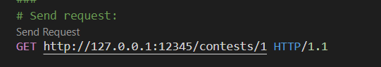

# 大作业：在线评测系统

2023 年夏季学期《程序设计训练》 Rust 课堂大作业（二）。

#### 李栋庭 2020011222 无16
## 简单的程序结构和说明

### `main.rs`
* `main` 函数：
    * `cli` 变量：`Cli` 结构体实例化的对象，用于读入保存 `config` 路径和判断是否 `flush-data`。 
    * `config` 变量：`Config` 结构体实例化的对象，用于读取并保存 `config` 文件中的内容。
    * `manager` 变量：`SqliteConnectionManager` 结构体，数据库
    * `pool` 变量：`Pool<SqliteConnectionManager>` 结构体，用于和数据库建立连接。
    * `conn` 变量：`PooledConnection<SqliteConnectionManager>`，和数据库所建立的连接。
    * `HttpServer::new` 函数：启动了一个 HTTP 服务器，监听在 127.0.0.1 地址的 12345 端口上。实现了 `exit`, `post_jobs`, `get_jobs` 等 API。
    * 主要逻辑：初始化以上变量，若数据库中无用户，则初始化一个用户，然后启动一个 HTTP 服务器，监听在 127.0.0.1 地址的 12345 端口上。

* `flush_user_table` 函数：根据 `cli` 判断是否清除数据库中内容。
* `creat_user_table` 函数：若表不存在，则建立表结构，具体的表结构见提高要求。
###  `config.rs`
* `Config` 结构体：
    ```rust
    // field
    server: Server,
    pub problems: Vec<Problem>,
    pub languages: Vec<Language>
    ```
* `Server` 结构体：
    ```rust
    // field
    bind_address: Option<String>,
    bind_port: Option<i32>
    ```
* `Problem` 结构体：
    ```rust
    // field
    pub id: usize,
    name: String,
    #[serde(rename = "type")]
    pub ty: String,
    pub misc: Option<Misc>,
    pub cases: Vec<Case>
    // impl
    pub fn new() -> Problem
    ```
* `Misc` 结构体：
    ```rust
    // field
    pub packing: Option<Vec<Vec<usize>>>,
    pub special_judge: Option<Vec<String>>
    ```
* `Case` 结构体：
    ```rust
    // field
    pub score: f64,
    pub input_file: String,
    pub answer_file: String,
    /// The unit is us, 0 means no limit
    pub time_limit: u64,
    /// The unit is byte, 0 means no limit
    pub memory_limit: u64,
    ```
* `Language` 结构体：
    ```rust
    // field
    pub name: String,
    pub file_name: String,
    pub command: Vec<String>,
    // impl
    pub fn new() -> Language
    ```
* `Cli` 结构体：
    ```rust
    // field
    #[arg(short, long)]
    pub config: String,
    #[arg(short = 'f', long = "flush-data")]
    pub flush_data: bool
    // impl
    pub fn init_config(&self) -> std::io::Result<Config>
    ```
### `job.rs`
* `Postjob` 结构体：接收 `Post /jobs` API 所传递的 json 格式内容
    ```rust
    // field
    source_code: String,
    language: String,
    pub user_id: usize,
    pub contest_id: usize,
    pub problem_id: usize,
    // impl
    fn new() -> PostJob
    ```
* `JobContent` 结构体：发送单个评测任务响应的 json 格式内容
    ```rust
    // field
    id: usize,
    pub created_time: String,
    updated_time: String,
    pub submission: PostJob,
    pub state: String,
    result: String,
    pub score: f64,
    cases: Vec<Case>,
    // impl
    fn new(len: usize) -> JobContent
    ```
* `Case` 结构体：评测任务的测例信息
    ```rust
    // field
    id: usize,
    result: String,
    time: u128,
    memory: u64,
    info: String
    // impl
    fn new(case_id: usize) -> Case 
    ```
* `Tempdir` 结构体：进行评测任务的临时文件夹
    ```rust
    // field
    path: String,
    src_path: String,
    app_path: String,
    //impl
    fn new(len: usize) -> Tempdir
    fn rm_tempdir(&self)
    fn compilate(&mut self, language: &Language, source_code: &String) -> bool
    fn judge(&self, case: &config::Case, ty: &String, special_judge: &Option<Vec<String>>) -> Vec<String>
    fn compare_out_ans(&self, ans_path: &String, ty: &String, special_judge: &Option<Vec<String>>) -> Vec<String>
    ```
* `post_jobs` 函数：
    * API: `POST /jobs`
    * 初始化变量 `tempdir`, `content`, `conn` 等；
    * 判断编程语言或题目 ID 或用户 ID 或比赛 ID 不存在，用户不在比赛中，或题目不在比赛中，或比赛尚未开始，或比赛已经结束，超出提交次数限制。
    * 经过以上判断之后进行评测：在临时文件夹中，先编译，后测试。
* `QueryJob` 结构体：
    ```rust
    // field
    user_id: Option<usize>,
    user_name: Option<String>,
    contest_id: Option<usize>,
    problem_id: Option<usize>,
    language: Option<String>,
    from: Option<String>,
    to: Option<String>,
    state: Option<String>,
    result: Option<String>
    // impl
    fn match_job(&self, job: &JobContent, conn: &PooledConnection<SqliteConnectionManager>) -> bool
    ```
* `get_jobs` 函数：
    * API: `GET /jobs`
    * 根据所要求的信息逐一对评测任务使用 `match_job` 函数进行比对，最后返回符合要求的评测任务。
* `get_jobs_id` 函数：
    * API: `GET /jobs/{jobId}`
    * 返回对应 `job_id` 的评测任务，未找到返回 404。
* `put_jobs` 函数：
    * API: `PUT /jobs/{jobId}`
    * 对已经完成评测的任务进行重新评测。

###  `user.rs`
* `PostUser` 结构体：接收 `Post /users` API 所传递的 json 格式内容
    ```rust
    // field
    id: Option<usize>,
    name: String
    ```
* `User` 结构体：发送单个用户响应的 json 格式内容
    ```rust
    // field
    pub id: usize,
    pub name: String
    // impl
    pub fn get_submisson_time(&self, job_list: &Vec<JobContent>) -> NaiveDateTime
    pub fn get_submisson_count(&self, job_list: &Vec<JobContent>) -> u64 
    ```
* `post_users` 函数：
    * API: `POST /users`
    * 判断用户名是否重复，然后判断 `body` 中 `id` 是否存在，若存在更新用户名，不存在新建用户。
* `get_users` 函数：
    * API: `GET /users`
    * 返回所有用户的信息。

### `contest.rs`
* `RankContent` 结构体：
    ```rust
    // field
    user: User,
    rank: u64,
    scores: Vec<f64>
    // impl
    fn check_self(&self, user_id: usize) -> bool 
    ```
* `PostContest` 结构体：
    ```rust
    id: Option<usize>,
    name: String,
    from: String,
    to: String,
    problem_ids: Vec<usize>,
    user_ids: Vec<usize>,
    submission_limit: u64
    ```
* `Contest` 结构体：
    ```rust
    id: usize,
    name: String,
    pub from: String,
    pub to: String,
    pub problem_ids: Vec<usize>,
    pub user_ids: Vec<usize>,
    pub submission_limit: u64
    ```
* `QueryRanklist` 结构体：
    ```rust
    scoring_rule: Option<String>,
    tie_breaker: Option<String>
    ```
* `get_contests_id_ranklist` 函数：
    * API: `GET /contests/{contestId}/ranklist`
    * 根据 `id` 判断进行不同的操作，若 `id` 为 0，总是表示全局排行榜，即包括所有的用户和所有的题目（按题目 id 升序），否则根据比赛 `id` 找到比赛，计算排行榜并发送响应。
    * 根据 `scoring_rule` 得到相应各个题目的分数和提交时间，然后根据 `tie_breaker` 进行排序。
* `post_contests` 函数：
    * API: `POST /contests`
    * 检查 `contest` 是否合法，然后根据是否有比赛 `id` 更新比赛或者新建比赛。
* `get_contests` 函数：
    * API: `GET /contests`
    * 以 JSON 响应返回所有比赛，按照 ID 升序排列。
* `get_contests_id` 函数：
    * API: `GET /contests/{contestId}`
    * 根据 URL 中的比赛 ID 找到比赛并发送响应。

## OJ 主要功能说明和截图
### POST /jobs
* 提交代码以创建一个新的评测任务。
* 请求:  

* 响应：  

### GET /jobs
* 根据 URL 参数查询和筛选评测任务。返回的结果按照任务创建时间升序排序。
* 请求:  

* 响应：  


### GET /jobs/{jobId}
* 获取单个评测任务信息。
* 请求:  

* 响应：  

### PUT /jobs/{jobId}
* 重新评测单个评测任务。
* 请求:  

* 响应：  


### POST /users
* 创建新用户或更新已有用户。
* 请求:  

* 响应：  


### GET /users
* 获取用户列表。
* 请求:  

* 响应：  


### POST /contests
* 创建新比赛或更新比赛内容。
* 请求:  

* 响应：  


### GET /contests
* 获取比赛列表。
* 请求:  

* 响应：  


### GET /contests/{contestId}
* 获取单个比赛信息。
* 请求:  

* 响应：  


### GET /contests/{contestId}/ranklist
* 获取单个比赛的排行榜。
* 请求:  

* 响应：  


## 提高要求的实现方式

### 多比赛支持
* 实现 /contests 开头的其余 API，支持新建或更新比赛，获取比赛信息和获取比赛排行榜。
* 比赛 ID 为 0 时特殊处理，认为比赛 0 包括所有用户和所有题目，用户和题目都按 id 升序，没有开始和结束时间，没有提交次数限制，比赛 0 的配置不可修改。
* 比赛 ID 不为 0 时为正常的比赛，需要通过 API 新建或更新。
  
### 持久化存储
选择 `SQLite` 作为数据库后端，表结构如下：
* users:
    ```rust
    "CREATE TABLE IF NOT EXISTS users (
        id INTEGER PRIMARY KEY,
        name TEXT NOT NULL
    )"
    ```
* contests:
    ```rust
    // problem_ids and user_ids need vec to test
    // when read, we need vec to test
    "CREATE TABLE IF NOT EXISTS contests (
        id INTEGER PRIMARY KEY,
        name TEXT NOT NULL,
        'from' TEXT NOT NULL,
        'to' TEXT NOT NULL,
        problem_ids TEXT NOT NULL,
        user_ids TEXT NOT NULL,
        submission_limit INTEGER NOT NULL
    )"
    ```

* jobs:
    ```rust
    // case need vec to test
    // when read, we need vec to test
    // sunmission divide into 5 parts
    "CREATE TABLE IF NOT EXISTS jobs (
        id INTEGER PRIMARY KEY,
        created_time TEXT NOT NULL,
        updated_time TEXT NOT NULL,
        source_code TEXT NOT NULL,
        language TEXT NOT NULL,
        user_id INTEGER NOT NULL,
        contest_id INTEGER NOT NULL,
        problem_id INTEGER NOT NULL,
        state TEXT NOT NULL,
        result TEXT NOT NULL,
        score REAL NOT NULL,
        cases TEXT NOT NULL
    )"
    ```
* `job.rs` 中新增如下函数：
    ```rust
    fn format_cases(v: &Vec<Case>) -> String 
    fn parse_cases(s: String) -> Vec<Case>
    pub fn query_jobs(conn: &Connection) -> Result<Vec<JobContent>>
    pub fn query_job(conn: &Connection, id: usize) -> Result<JobContent>
    fn insert_job(conn: &Connection, job: &JobContent) -> Result<()> 
    fn update_job(conn: &Connection, job: &JobContent) -> Result<()> 
    ```
* `contest.rs` 和 `user.rs` 同样增加对应的函数提高代码复用性。 

### 非阻塞评测
* 将评测与 API 请求处理分离，即创建任务的请求应该立刻返回（返回 Queueing 状态），使用额外的线程运行评测，所有评测任务相关函数均改为异步函数，以下为主要函数：
    ```rust
    async fn compilate(&mut self, language: &Language, source_code: &String) -> bool
    async fn judge(&self, case: &config::Case, ty: &String) -> String 
    async fn judge_job(
        job_id: usize,
        pool: web::Data<Pool<SqliteConnectionManager>>,
        problems: Vec<Problem>,
        languages: Vec<Language>
    ) 
    ```
* POST /jobs 响应：


* GET /jobs/0 响应：


### 打包测试
* 支持将测试点分为若干个组（每一组称为一个子任务，子任务的集合构成对测试点集合的一个划分，且子任务内测试点编号连续），每一组必须所有测试点均正确才能获得所有分数，否则该组整体不得分。
* 在 `post_jobs` 和 `put_jobs` 函数中新增判断是否为打包测试环节
* 响应：


### Special Judge
* 而是通过外部程序将用户程序输出与标准答案进行对比，并给出得分。此选项即对应题目配置的 type 为 spj。
* 更改 `Tempdir` 中 `compare_out_ans` 函数，当类型为 `spj` 时，在命令行中运行对应指令比对。


## 完成此作业感想
* 助教提供的作业要求很全面，基本照着文档写没有什么大问题。
* 最后验收是否发现自己还是有很多地方没有考虑到，需要改进。特别是测例自己用的太少了，有些很简单的测例自己没用，结果验收时程序数组越界导致 bug。
* rust 有很多库很方便，自己造轮子 bug 特别多，效果还不如直接调库。